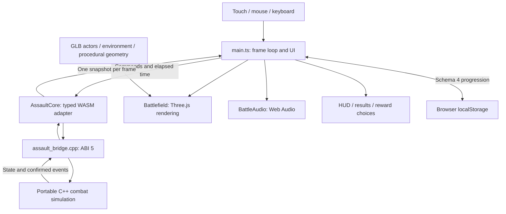

# Mechalord

Original portrait 3D battle prototype. The current **Iron Front** playable build uses fixed-step C++ combat compiled to WebAssembly and Three.js rendering. Unreal sources/workshop are included; this is not yet a packaged Android or iOS game.

The current branch, `codex/iron-front-single-siege`, has one continuous Iron March: Skyforge viaduct, storm reactor trench, forge citadel, then one final Tyrant. Combat state carries across environments. Barrage replaces Overdrive with physical shoulder launchers and real rocket volleys.

Read [HANDOFF.md](HANDOFF.md) for build instructions, implementation and verification limits, and [MEMORY.md](MEMORY.md) for decisions and continuation rules. Historical reports describe their own checkpoints.

The detailed [feedback changelog](FEEDBACK_CHANGELOG.md) compares the saved version before the latest feedback (`2cb2e38`) with the completed implementation (`73430b6`), including before/after behavior, changed files, verification and remaining limitations.

## Play

From the repository root:

```powershell
python -m http.server 8077 --bind 127.0.0.1 --directory delivery
```

Open `http://127.0.0.1:8077/playable/index.html`. Drag horizontally or use arrow keys; firing is automatic. Charge Shield, EMP and Barrage in combat, then tap their icons or use 1 / 2 / 3. The separate `playable/review.html` is an internal automated visual review tool.

## Project architecture

The current game has two main runtime layers: a portable C++ simulation that decides combat outcomes, and a browser presentation layer that turns those decisions into 3D graphics, sound and UI. The C++ source sits inside the Unreal project folder but is also compiled directly into WebAssembly for this playable build. It does not require the Unreal Editor to run in the browser.



### Combat simulation and browser boundary

[`AssaultSimulation.cpp`](game/Mechalord/Source/Mechalord/AssaultSimulation.cpp) owns movement, collision and damage, logical army size, enemies, gates, projectiles, powers, boss parts, phases and the authored spawn ledger. It advances at a fixed **60 simulation steps per second**, accumulating elapsed time supplied by the browser. Rendering frame rate is separate from that combat step.

[`CampaignEncounters.h`](game/Mechalord/Source/Mechalord/CampaignEncounters.h) defines the single Iron March timeline. [`BossPose.h`](game/Mechalord/Source/Mechalord/BossPose.h) and the boss pose model provide the pose and geometry used for spatial hit regions. This lets the renderer show the same limbs and weapon positions used by combat rather than inventing a second damage model.

[`assault_bridge.cpp`](tools/playable-preview/assault_bridge.cpp) exports commands and bounded state arrays from the compiled core. [`assault-core.ts`](tools/playable-preview/assault-core.ts) checks ABI version 5 and decodes those arrays into the types in [`contract.ts`](tools/playable-preview/contract.ts). Its public commands include starting a run, steering/stepping, using relics, firing a laser, pulsing a clash, healing/reviving and choosing an imprint.

The core uses fixed-capacity pools: 256 targets, 256 friendly shots, 96 hostile shots, 192 effects and 24 pickups. Logical troop count is separate from the 24 formation slots used to represent the army. These are current implementation limits, not the earlier proposed 80-unit visual target.

### Frame loop, graphics and feedback

[`main.ts`](tools/playable-preview/main.ts) owns browser input, the frame loop, pause/focus handling, HUD and run transitions. Each frame submits permitted commands, takes **one snapshot**, dispatches its confirmed events, and updates the battlefield and audio. Snapshot reads drain the event buffer, so additional reads must not accidentally consume hit/death events before presentation sees them.

[`world.ts`](tools/playable-preview/world.ts) implements `Battlefield`, the shared Three.js scene used by normal play and internal review. It loads retained GLB actors, positions the portrait camera, updates pooled/instanced troops and enemies, and coordinates these presentation modules:

| Responsibility | Main module |
|---|---|
| Boss pose, vulnerable-part cues and confirmed hit flashes | [`boss-rig-adapter.ts`](tools/playable-preview/boss-rig-adapter.ts) |
| Commander movement and army articulation | [`commander-locomotion.ts`](tools/playable-preview/commander-locomotion.ts), [`animated-troop-crowd.ts`](tools/playable-preview/animated-troop-crowd.ts) |
| Projectiles, impacts, beam geometry and enemy cues | [`combat-visuals.ts`](tools/playable-preview/combat-visuals.ts), [`plasma-beam-style.ts`](tools/playable-preview/plasma-beam-style.ts) |
| Laser collision presentation | [`laser-clash-visuals.ts`](tools/playable-preview/laser-clash-visuals.ts) |
| Shield, EMP and physical Barrage launchers | [`relic-effects.ts`](tools/playable-preview/relic-effects.ts), [`plated-shield.ts`](tools/playable-preview/plated-shield.ts), [`storm-battery.ts`](tools/playable-preview/storm-battery.ts) |
| Continuous environment and palette transitions | [`continuous-route-environment.ts`](tools/playable-preview/continuous-route-environment.ts) |
| Original synthesized sound/music and playback limits | [`audio.ts`](tools/playable-preview/audio.ts) |

These modules visualize the simulation; they do not award damage independently. Published projectile origins, hit-region identities, boss epochs and confirmed damage events keep visuals tied to actual combat. During pause, the picture remains visible and effect time stops.

### Continuous level, progression and saves

Campaign index 5 is one 198-second authored approach through Skyforge, the reactor trench and the citadel, followed by one final Tyrant. Environment markers at 62 and 128 seconds preserve live combat state. Global progress is `travelDistance / travelGoal`; the legacy `actIndex`, `stageLevel` and `actStart` names now identify zones within this campaign. Practice indices 0–4 remain independent fronts.

The environment renderer recycles sections anchored to world distance, loads 14 retained environment GLBs, animates mechanical joints and blends palettes around boundaries. Zone entry does not clear projectiles or reset troops. The final arena occurs once.

Progression/save logic currently lives in `main.ts`, not a separate progression service. Schema 4 saves commander XP/rank, selected front, cleared fronts, best scores and one replacement legacy imprint under `mechalord-iron-front-progress-v1` in browser `localStorage`. Old schemas are migrated; malformed or blocked storage has a session fallback. There is no cloud account/save synchronization or payment service in this build.

### Asset pipeline and reproducible builds

Reference images, original models, Blender sources, edited exports and provenance manifests are kept in separate `art`/`assets` folders. Current shipped actor mappings are explicit in [`build.mjs`](tools/playable-preview/build.mjs). The commander/troop reconstruction has unresolved upstream output-license details; see [asset provenance](docs/asset-provenance-publication.md) before commercial distribution.

[`build_assault.ps1`](tools/playable-preview/build_assault.ps1) compiles the portable simulation and bridge into `delivery/playable/assault.wasm`. `build.mjs` then bundles the browser entrypoints with esbuild, copies the selected GLBs and writes the [build manifest](builds/playable-build-manifest.json). The JS bundle embeds an immutable hashed WASM filename, and HTML uses script/CSS hashes to prevent stale-version pairing. Always compile the core before bundling; full prerequisites are in [HANDOFF.md](HANDOFF.md#run-and-rebuild).

### Testing and the Unreal boundary

Native C++ fixtures check simulation behavior. Shipping-adapter tests exercise the actual WASM through its public controls. CPU geometry tests inspect renderer transforms, bounds and lifecycle; mocked UI tests check menu/save/HUD behavior. Real browser screenshots provide rendered evidence. These categories are distinct: an automated winning route is not a human difficulty study, and a CPU geometry pass is not a phone performance measurement. See [delivery results](docs/single-siege-results.md) and the [proof captions](delivery/single-siege-proof/README.md).

`review.html` uses the same core and `Battlefield` as `index.html`, with automated aiming and seek/step tools. It is a QA tool, not a separate gameplay implementation.

`game/Mechalord` contains Unreal project scaffolding and the portable combat sources. Its current native GameMode still wires the earlier runner/siege simulation. `game/MechalordArtLab` is an asset workshop. Neither currently supplies a verified native adapter for this browser assault. Porting the authoritative simulation, input, actors, HUD and saves into Unreal remains a separate milestone, followed by Android packaging/Nothing Phone (3) testing and later iOS work. See [native readiness](docs/native-readiness-2026-10-06.md).

## Project layout

- `art/concepts`: original image-generated pilot references; these are images, not 3D models.
- `art/prompts`: reproducible prompt records.
- `assets/originals`, `source`, `exports`, `previews`, `manifests`: asset production stages and provenance.
- `game/Mechalord`: Unreal project scaffolding plus the portable combat simulation sources.
- `game/MechalordArtLab`: Unreal asset workshop.
- `docs`: research, design, monetization roadmap, production and verification records.
- `tools/playable-preview`: current browser runtime, renderer, build scripts and tests. Other tools cover asset preparation and native setup experiments.
- `builds`: selected generated verification receipts; no verified Android package yet.
- `delivery`: verified handoff outputs.

Use [HANDOFF.md](HANDOFF.md) and [native readiness](docs/native-readiness-2026-10-06.md) for current implementation/build limits. Older [implementation status](docs/status.md) and [setup](docs/setup.md) records describe earlier milestones and are retained as history.

The first Android chapter remains free to retry, without advertisements or purchases. Gem revivals, hero unlocks and skins are future research milestones, not active payment features.

The original references are now hosted at [mechalord-asset-references](https://github.com/mahikshith/mechalord-asset-references). See [the required visual standard](docs/visual-standard.md). The simplified Blender blockouts were rejected and are excluded from production.
